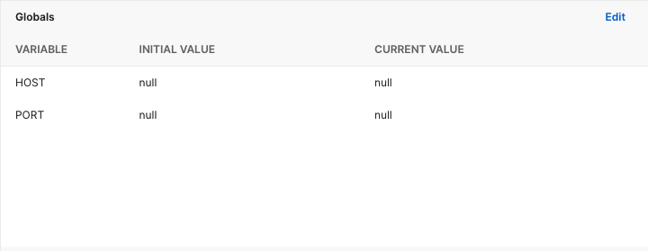

<div id="top"></div>

<h1 align="center">YouTube Automation Server Node TS</h1>

<div align="center">
  <p align="center">
    This server-side application is for automation sharing/unsharing youtube videos to a certain emails. 
  </p>
</div>

<!-- TABLE OF CONTENTS -->
<details>
  <summary>Table of Contents</summary>
  <ol>
    <li>
      <a href="#about-the-application">About The Application</a>
      <ul>
        <li><a href="#built-with">Built With</a></li>
      </ul>
    </li>
    <li><a href="#how-to-install">How To Install</a></li>
    <li><a href="#available-scripts">Available Scripts</a></li>
    <li><a href="#postman">Postman</a></li>
  </ol>
</details>

<!-- ABOUT THE APPLICATION -->

## About The Application

This server-side application is for automation sharing/unsharing youtube videos to a certain emails.

It is built with Node.js and Express Framework with TypeScript. In addition, the application uses Puppeteer to perform the automation tasks.

<p align="right">(<a href="#top">back to top</a>)</p>

### Built With

-   [Node.js](https://nodejs.org/en/)
-   [Express](https://expressjs.com/)
-   [TypeScript](https://www.typescriptlang.org/)
-   [Cors](https://www.npmjs.com/package/cors)
-   [Puppeteer](https://pptr.dev/)

<p align="right">(<a href="#top">back to top</a>)</p>

<!-- INSTALLATION INSTRUCTIONS -->

## How To Install

**Git clone**

```
git clone
```

**Instructions**

-   After cloning the the repository run `npm i` in order to install all the dependencies.
-   Create an env file in the root of the project named `.env` and fill in the follwing variables: PORT, OAUTH2_GOOGLE_URL, EMAIL, PASSWORD, YOUTUBE_STUDIO_DASHBOARD_URL

<p align="right">(<a href="#top">back to top</a>)</p>

<!--  AVAILABLE SCRIPTS -->

## Available Scripts

In the project directory, you can run:

### `npm start`

Runs the app in the production mode.\
However this script is only ment to be run when deploying the application. The application is built, where you need to setup the env variables on the machine that your will be hosting it on or in a webhosting service, unlike in development mode.

### `npm run dev`

Runs the app in the development mode.\
Open localhost on the port you decided on in the env variables to view it in the browser.

The page will reload if you make edits with nodemon.

<p align="right">(<a href="#top">back to top</a>)</p>

<!-- POSTMAN -->

## Postman

included in the repository, in the `postman` directory all the files so you can import them directly into Postman. In addition, you will have to configure env variables in postman so that you will be able to test everything properly.

<div align="center">
  
</div>

<p align="right">(<a href="#top">back to top</a>)</p>
